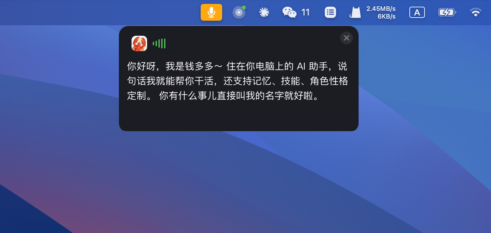

**English** | [中文](./README_CN.md)

<h1 align="center">Lumi</h1>

<p align="center"><strong>The AI Agent that lives in your menu bar.</strong></p>

<p align="center">Voice-first. Always ready. Knows you, remembers you.</p>

<p align="center">


</p>

<p align="center">

</p>

Lumi is a native macOS voice AI assistant. It lives in your menu bar — you speak, it listens, it gets things done. Search the web, write code, control your system, and it remembers everything you've talked about.

We believe the most natural way to interact with AI is voice — you speak, it listens. And the best way for AI to respond is through vision — it shows you. [Karpathy](https://x.com/karpathy/status/2053872850101285137) said that voice is the natural input for humans, and vision is the natural output for machines — nearly a third of the brain's processing power is dedicated to visual information. Lumi is still an early demo, but we want to keep refining in this direction, exploring what the interaction between humans and truly intelligent AI should look like.

## Features

### 🎙️ Voice-First Interaction

Just speak. Lumi listens in real time, transcribes your voice via ASR, processes it with AI, and responds via TTS. You don't even need to look at the screen — a transparent subtitle popup shows the response in real time. Supports Chat mode: after you finish speaking, it automatically listens for the next sentence.

### ⚡ Always Ready

Two ways to invoke, your choice:

- **Hotkey**: Press Right Option to start recording, release to send
- **Wake Word**: Call the AI by name and it starts listening

### 🎭 Personalities & Personas

Customize the AI's personality, speaking style, and behavior through the Persona system. Each persona is a Markdown file with a custom avatar. Create multiple personas — work assistant, creative partner, study coach — and switch between them anytime.

### 🛠️ Skill System

Equip the AI with skills. Import skill packs via Markdown or Zip files to teach it specific tools and workflows. Built-in skill directory management with one-click enable/disable.

### 🧠 Memory System

The AI automatically remembers what you talked about each day. Daily memories are written automatically, core memories are periodically evaluated — the more you use it, the better it knows you. Review past memories anytime to see what the AI has learned about you.

### 🔌 Multi-Provider Support

Supports 13 AI backends, switch on the fly:

- **International**: Anthropic (Claude), OpenAI (ChatGPT)
- **Chinese Providers**: GLM (CN/Global), DeepSeek, Moonshot (Kimi), MiniMax (CN/Global), Qwen (Bailian), Volcengine (Doubao), Xiaomi MiMo
- **Aggregators**: OpenRouter, SiliconFlow

Voice services also support multiple providers: Volcengine (Doubao Voice) and Alibaba Cloud Bailian (Paraformer ASR + CosyVoice TTS). ASR and TTS providers can be selected independently.

### 📍 Menu Bar Resident

No Dock icon, no desktop clutter. Lumi quietly lives in the menu bar. The tray indicator dot reflects the current state in real time: gray for idle, blue for thinking, green for done, red for error.

## Demo

> Some clips in the videos are sped up for demonstration. Actual Agent execution takes time.

https://github.com/user-attachments/assets/fc44c44b-82ee-4923-b701-030fe7c096b4

https://github.com/user-attachments/assets/de213cfb-6a36-4bae-a5bc-e74c91fc3015

## Getting Started

### Prerequisites

- macOS 13.0+
- Node.js 18+
- Xcode Command Line Tools (for compiling native modules)

### Install & Run

```bash
git clone https://github.com/Wechat-ggGitHub/Lumi.git
cd Lumi
npm install
npm run electron:dev
```

### Build

```bash
npm run electron:build
```

The build output is in the `release/` directory.

### Available Scripts

| Script | Description |
|---|---|
| `npm run electron:dev` | Dev mode, starts Next.js + Electron concurrently |
| `npm run electron:build` | Full build and package DMG |
| `npm run build:electron` | Compile Electron main process only |
| `npm run build` | Build Next.js only |

## Architecture

### Overview

The Electron main process spawns a Next.js 15 standalone server on a random port, connecting front-end and back-end via IPC (not REST API). In production, Next.js runs as a child process inside Electron.

```
┌─────────────────────────────────────────┐
│              Electron Main              │
│                                         │
│  ┌─────────────┐  ┌──────────────────┐  │
│  │  Tray +      │  │  Voice Pipeline  │  │
│  │  Shortcuts   │  │  (ASR/TTS/VAD)   │  │
│  └─────────────┘  └──────────────────┘  │
│                                         │
│  ┌─────────────────────────────────────┐│
│  │         Next.js 15 (embedded)       ││
│  │    BrowserWindow ←→ IPC ←→ Main    ││
│  └─────────────────────────────────────┘│
└─────────────────────────────────────────┘
```

### Voice Pipeline

```
AudioListener → WakeWordEngine (sherpa-onnx)
             → VoiceEndpoint (VAD silence detection)
             → AudioRecorder (recording)
             → ASR Provider (Volcengine / Alibaba Bailian)
             → Claude Agent SDK (AI processing)
             → TTS Provider (Volcengine / Alibaba Bailian)
             → SubtitlePopup (subtitle overlay)
```

### State Machine

```
idle → recording → transcribing → thinking → executing → completed → idle
```

### Directory Structure

```
Lumi/
├── electron/                  # Electron main process
│   ├── main.ts                # Core orchestration (window, state machine, voice pipeline, IPC)
│   ├── tray.ts                # Menu bar tray + status indicator
│   ├── shortcuts.ts           # Global hotkeys
│   ├── recorder.ts            # Audio recording + ASR
│   ├── tts.ts                 # TTS + sentence parsing
│   ├── voice-providers/       # Voice provider abstraction layer
│   ├── voice-bar.ts           # Floating voice recording indicator
│   ├── subtitle-popup.ts      # Transparent subtitle popup
│   ├── wake-word.ts           # sherpa-onnx wake word engine
│   ├── audio-listener.ts      # Microphone audio stream listener
│   └── native/                # Swift native module (keyboard event interception)
├── src/
│   ├── app/
│   │   ├── (main)/            # Main window pages (chat/memory/persona/skills/settings)
│   │   └── (transparent)/     # Transparent popups (subtitle, voice bar)
│   ├── components/            # UI components
│   ├── lib/                   # Shared libraries (state management, AI client, memory, skills)
│   └── types/                 # TypeScript type definitions
├── resources/                 # App resources (icons, sherpa-onnx models)
└── scripts/                   # Build scripts
```

### Tech Stack

| Layer | Technology |
|---|---|
| Desktop Framework | Electron 35 |
| Frontend | Next.js 15, React 19, TypeScript |
| Styling | Tailwind CSS |
| Voice Engine | sherpa-onnx (wake word + VAD) |
| Speech Recognition | Volcengine ASR, Alibaba Bailian Paraformer |
| Speech Synthesis | Volcengine TTS, Alibaba Bailian CosyVoice |
| AI Execution | Claude Agent SDK |
| Database | better-sqlite3 |
| Native Modules | Swift (keyboard event interception), uiohook-napi |
| Packaging | electron-builder (DMG) |

## Roadmap

- [ ] **Intent Routing** — Automatically assess task complexity: simple Q&A gets fast responses, complex tasks engage the full Agent toolchain
- [ ] **Voice-First Response** — AI responds with voice before executing tasks, making interaction feel more natural instead of staying silent until done
- [ ] **Screen Awareness** — Monitor the area around the cursor so AI understands on-screen context for contextual conversation and actions
- [ ] **Voice Selection & Cloning** — Support switching TTS voices and cloning custom voices from a few audio samples

## License

MIT
